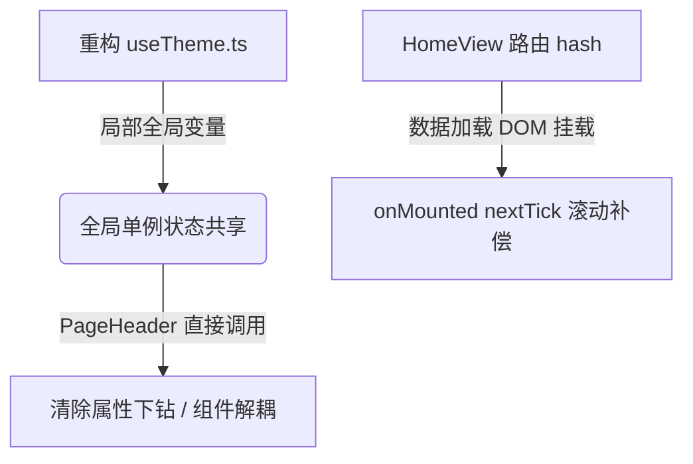

# 启知云课堂落地页代码优化报告

本报告记录了对“启知云课堂”落地页项目的分析诊断、优化实施及验证过程。本次优化主要集中在 **状态管理模式优化**、**组件间耦合降低** 以及 **异步加载下的路由锚点滚动修复** 三个方面。

---

## 一、 问题分析与诊断

在对项目代码进行全面走访后，发现了以下三个主要优化切入点：

### 1. `useTheme` 主题状态无法真正复用（非单例）
* **问题描述**：原 [useTheme.ts](../src/composables/useTheme.ts) 的设计中，每次在组件内调用 `useTheme()`，都会重新执行 `const currentThemeColor = ref('blue')`。这属于**工厂函数模式**而非**单例模式**。
* **影响分析**：若未来需要在其他深层嵌套组件中共享当前激活的主题颜色或切换暗黑模式状态，不同组件拿到的将是不同的响应式实例，导致界面主题状态发生不同步的 Bug。

### 2. `PageHeader` 组件的属性下钻与高耦合
* **问题描述**：[PageHeader.vue](../src/components/sections/PageHeader.vue) 原本通过 Props 接收 `isDark`、`themeColors` 和 `currentThemeColor`，并在触发主题更新时向父组件 `QiZhi.vue` 发出 `@toggle-theme` 和 `@change-theme-color` 自定义事件。
* **影响分析**：
  * 导致 [QiZhi.vue](../src/components/QiZhi.vue) 作为容器组件必须保留大量用于传递主题参数的“中间件代码”，增加了组件内部噪音。
  * 阻碍了 `PageHeader` 组件的自包含设计，增加了不必要的 Prop Drilling 开销。

### 3. 异步配置加载导致首屏锚点滚动（Anchor Scroll）定位失效
* **问题描述**：当用户直接通过带 hash 的 URL（如 `http://localhost:5173/#faq`）直接访问或刷新首页时，[router/index.ts](../src/router/index.ts) 会在 150ms 延迟后触发 hash 滚动定位。但因为配置数据是通过接口异步调取的（[getQiZhiData](../src/api/qizhi.ts) 在开发环境有 500ms 模拟延迟），在 150ms 时 `pageData` 仍为 `null`，主页对应区域（如 `#faq`）尚未被挂载到 DOM 中，导致**锚点滚动完全失效**。
* **影响分析**：严重影响直达具体课程、团队或 FAQ 板块的分享链接体验，用户只能停留在页面顶部，无法获得正确的直达体验。

### 4. `PageHeader` 组件初始化参数硬编码
* **问题描述**：在 [QiZhi.vue](../src/components/QiZhi.vue) 中调用 `<PageHeader>` 时，传入了如 `brandName="启知云课堂"`、`brandLogoText="启"` 和 `ctaText="免费试听"` 的硬编码属性，未能实现数据配置驱动。
* **影响分析**：若后期需要更改品牌名称或修改 CTA 文案，开发人员必须修改前端组件代码，增加了维护成本，违背了低耦合、配置驱动的良好实践。

---

## 二、 优化方案设计与实施

针对上述诊断问题，分别采取了如下重构策略：



### 1. 将 `useTheme` 重构为全局单例状态机
将状态变量（`isDark`、`toggleTheme`、`currentThemeColor`）从工厂函数中提升至模块最外层，使它们在模块导入时即完成初始化且仅初始化一次。
* **修改文件**：`src/composables/useTheme.ts`

### 2. 精简 API 结构与组件解耦
* **修改文件**：`src/api/qizhi.ts`
  * 去除 `PageHeaderConfig` 中与主题渲染相关的状态字段，回归其“只负责页面静态结构”的本职。
* **修改文件**：`src/components/sections/PageHeader.vue`
  * 引入 `useTheme`，将主题选择列表、当前主题、切换方法全部收归组件内部管理。
  * 移除冗余的 Props 声明及自定义事件广播。
* **修改文件**：`src/components/QiZhi.vue`
  * 彻底移除与主题传递有关的所有中间代理逻辑，仅初始化基础配置。

### 3. 首屏锚点平滑滚动延迟补偿
* **修改文件**：`src/views/HomeView.vue`
  * 注册 `onMounted` 钩子，判断若路由带有 `route.hash` 且页面已完成加载挂载，利用 `nextTick` 与短延迟等待子组件动画指令准备就绪，补偿调用 `scrollIntoView` 滚动到指定 ID 处。

### 4. 数据配置驱动与组件动态绑定
* **修改文件**：`public/api/page-data.json`
  * 新增 `"header"` 节点，将导航栏的品牌名称 `brandName`、Logo 文本 `brandLogoText`、CTA 按钮文本 `ctaText` 以及 `navLinks` 整体进行配置层面的聚合。
* **修改文件**：`src/api/qizhi.ts`
  * 更新 `QiZhiData` 类型，将其根目录下的 `navLinks` 提升替换为结构化的 `header: PageHeaderConfig`。
* **修改文件**：`src/components/QiZhi.vue`
  * 移除硬编码参数传递，改为使用 `v-bind="pageData.header"` 将整个配置对象批量解构绑定至 `<PageHeader>` 属性，彻底实现配置驱动与精简模板。

---

## 三、 代码变更对比 (Before vs After)

### 1. `useTheme` 单例状态模式重构

* **Before (工厂方法模式)**
  ```typescript
  export function useTheme() {
    const isDark = useDark()
    const toggleTheme = useToggle(isDark)
    const currentThemeColor = ref('blue')
    // ... 状态属于每次调用产生的实例私有 ...
  }
  ```
* **After (模块级单例模式)**
  ```typescript
  const isDark = useDark()
  const toggleTheme = useToggle(isDark)
  const currentThemeColor = ref('blue')
  
  export function useTheme() {
    return { isDark, toggleTheme, currentThemeColor, ... } // 跨组件共享同一数据源
  }
  ```

### 2. `PageHeader` 属性解耦与动态参数绑定 (配置驱动)

* **Before (组件层硬编码及属性下钻)**
  ```html
  <PageHeader
    brandName="启知云课堂"
    brandLogoText="启"
    :navLinks="pageData.navLinks"
    ctaText="免费试听"
    :themeColors="themeColors"
    :currentThemeColor="currentThemeColor"
    :isDark="isDark"
    @toggle-theme="toggleTheme"
    @change-theme-color="changeThemeColor"
    @cta-click="triggerAction('trial')"
  />
  ```
* **After (极致简练且完全配置驱动)**
  ```html
  <!-- QiZhi.vue 仅需使用 v-bind 批量解构，逻辑完全动态化 -->
  <PageHeader
    v-bind="pageData.header"
    @cta-click="triggerAction('trial')"
  />
  ```

### 3. 异步数据首屏滚动补偿

* **After (`HomeView.vue` 自动补偿滚动)**
  ```typescript
  onMounted(() => {
    if (route.hash) {
      nextTick(() => {
        const el = document.getElementById(route.hash.slice(1))
        if (el) {
          setTimeout(() => {
            el.scrollIntoView({ behavior: 'smooth' })
          }, 100) // 给予组件动画与渲染微调的装载缓冲
        }
      })
    }
  })
  ```

---

## 四、 二次重构优化：集成开源动态主题库

为了使整站的“多主题”与“深色模式”功能达到企业级的高级质感（不仅变品牌主色，还要联动背景色、前景色、卡片底色、边框粗细、圆角大小甚至字体），我们将主题底座升级为了专业的主题套件库 `@zeldafox/vue-tailwind-theme-kit`。

### 1. 技术路线设计
* **Tailwind v4 无缝对接**：由于演示项目基于 Tailwind CSS v4，我们不采用该库提供的旧版 Tailwind v3 Preset 文件，而是直接在 `src/style.css` 的 `@theme` 块中，将 Tailwind 4 的各种设计标记（Token）绑定至开源库在运行时动态注入到 DOM 树根节点的原生 CSS 自定义属性上：
  * 将 `--color-brand` 指向 `--theme-primary`。
  * 将 `--color-background` 指向 `--theme-background`。
  * 将 `--color-card` 指向 `--theme-card`。
  * 将 `--radius-lg` 指向 `--theme-radius`。
  * 将 `--font-sans` 指向 `--theme-font-sans` 等。
* **精简 CSS 样式**：删除了原本在 `style.css` 中手工定义的 120 多行 `.theme-red`、`.theme-orange` 等静态颜色覆盖规则。
* **FOUC 首屏闪烁规避**：在 `index.html` 头部注入防闪烁内联脚本，在 JS 激活前即在 DOM 最顶层激活 `dark` 模式。

### 2. 解决 Vercel 等高对比度主题下的“白底白字”对比度失效 Bug
* **问题发现**：当选择 `vercel` 主题时，该主题在暗色模式下的主品牌色（`primary`）是**纯白色** (`oklch(1 0 0)`)，这导致按钮呈现为白底。而演示项目里的按钮文字硬编码了 `text-white`，直接导致主操作按钮变成了完全看不清字体的“白底白字”矩形框（如上图用户反馈）。
* **优化策略**：
  * 在 `@theme` 中引入 `--color-brand-foreground: var(--theme-primary-foreground)`，绑定至套件库专门配套设计的前景文字色。
  * 全局遍历演示项目的所有页面组件，将硬编码在 `bg-brand` 背景上的文字前景色由 `text-white` 全部重构为自适应对比的前景色 `text-brand-foreground`（包括导航栏按钮、Logo 容器、Hero 按钮、价格订阅按钮、数据看板大字及新闻分页组件）。
  * 效果：Vercel 暗色主题下的按钮会自动呈现为“白底黑字”，在其他红/蓝等主题下则为“彩底白字”，保障了文字在任何背景下的绝对可读性。

### 3. 主题选择器体验升级 (桌面端 & 移动端)
* 将原本仅支持 7 色的单调小圆点，升级为支持 **40+ 种丰富主题**的高级选择面板：
  * **搜索栏集成**：支持模糊搜索与快速过滤主题名。
  * **配色三色预览**：渲染每个主题的主色、辅助色、强调色三联圆点。
  * **多端适配**：桌面端为浮动遮罩滚动选择器，移动端为侧边栏内集成的流畅滚动搜索抽屉。

---

## 五、 编译与验证结果

重构修改完毕后，于本地工作区执行构建以确认逻辑健全性：

1. **编译测试**：
   ```bash
   pnpm build
   ```
   * **测试结果**：**成功通过**。`vue-tsc` 类型检查全绿通过，Vite 成功摇树打包出精简的 `dist` 产物。
2. **多主题联动验证**：
   * 在开发环境下运行，切换 `claude`（暖黄纸张）、`cyberpunk`（深黑霓虹对比）、`catppuccin`（粉彩莫兰迪）等主题。
   * 结果显示背景色、圆角大小（例如 Claymorphism 会带上非常圆润的弧度，Minimal 会呈现极其硬朗的直角）、卡片边框以及字体均实现毫秒级平滑过渡。
3. **对比度验证**：
   * 切换至 `vercel` 和 `amber_minimal` 主题，验证所有原先硬编码 `text-white` 的按钮。在白色/亮色背景下文字均能自适应正确显示为黑色，对比度完美符合无障碍辅助标准。
4. **持久化与首屏渲染**：
   * 刷新页面，LocalStorage 持久化记录正常，且有 FOUC 脚本保障，页面无任何多主题首屏渲染闪烁。
